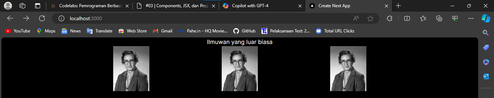
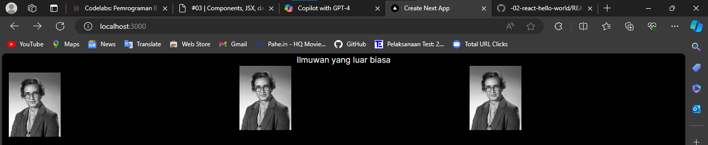
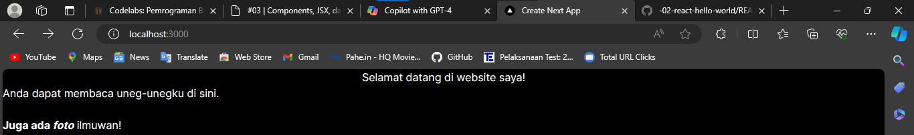
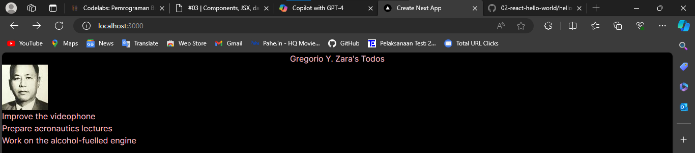
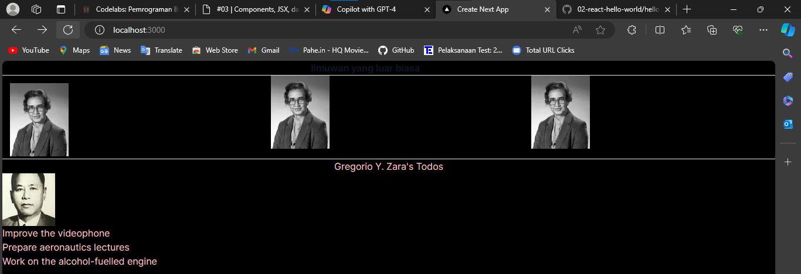
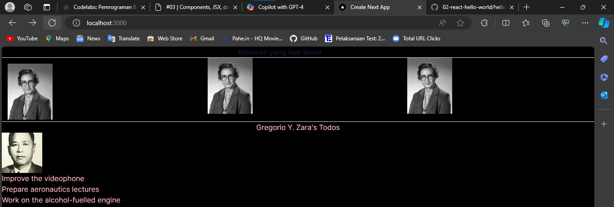

This is a [Next.js](https://nextjs.org/) project bootstrapped with [`create-next-app`](https://github.com/vercel/next.js/tree/canary/packages/create-next-app).

## Getting Started

First, run the development server:

```bash
npm run dev
# or
yarn dev
# or
pnpm dev
# or
bun dev
```

Open [http://localhost:3000](http://localhost:3000) with your browser to see the result.

You can start editing the page by modifying `app/page.tsx`. The page auto-updates as you edit the file.

This project uses [`next/font`](https://nextjs.org/docs/basic-features/font-optimization) to automatically optimize and load Inter, a custom Google Font.

## Learn More

To learn more about Next.js, take a look at the following resources:

- [Next.js Documentation](https://nextjs.org/docs) - learn about Next.js features and API.
- [Learn Next.js](https://nextjs.org/learn) - an interactive Next.js tutorial.

You can check out [the Next.js GitHub repository](https://github.com/vercel/next.js/) - your feedback and contributions are welcome!

## Deploy on Vercel

The easiest way to deploy your Next.js app is to use the [Vercel Platform](https://vercel.com/new?utm_medium=default-template&filter=next.js&utm_source=create-next-app&utm_campaign=create-next-app-readme) from the creators of Next.js.

Check out our [Next.js deployment documentation](https://nextjs.org/docs/deployment) for more details.

## Laporan Praktikum

|  | Pemrograman Berbasis Framework 2024 |
|--|--|
| NIM |  2141720230 |
| Nama |  Ilham Khalis Putra Agatha |
| Kelas | TI - 3A |

### Jawaban Soal 1

Ubah isi kode Home() sehingga dapat tampil seperti berikut dengan memanfaatkan komponen Profile() yang tadi sudah dibuat dari langkah 1 tersebut!



Capture hasilnya dan buatlah laporan di README.md. Jelaskan apa yang telah Anda pelajari dan bagaimana Anda solve error tersebut?
Saya mempelajari cara mendefinisikan komponon dan cara saya memperbaiki erorr deengan cara menambahkan code di file next.config.js.

### Jawaban Soal 2

Capture hasilnya dan buatlah laporan di README.md. Jelaskan apa yang telah Anda pelajari dan bagaimana tampilannya saat ini?



Saya mempelajari membuat komponen baru, mengimport komponen tersebut, dan update pada page.tsx menghasilkan output yang kurang lebih sama dengan cara yang berbeda.

### Jawaban Soal 2

Silakan perbaiki kode JSX berikut ini. Anda boleh menggunakan konverter atau perbaiki secara manual.

Code program setelah diperbaiki
```
export default function Bio() {
    return (
      <div className="intro">
        <h1>Selamat datang di website saya!</h1>
        <p className="summary">
          Anda dapat membaca uneg-unegku di sini.
          <br /><br />
          <b>Juga ada <i>foto</i></b> ilmuwan!
        </p>
      </div>
    );
}
```

### Jawaban Soal 3

Capture hasilnya dan buatlah laporan di README.md. Jelaskan apa yang telah Anda pelajari dan mengapa error itu bisa terjadi?



Error tersebut terjadi karena sintaks JSX tidak benar. JSX adalah sintaks yang mirip dengan HTML dan digunakan dalam React untuk menulis UI. Namun, ada beberapa perbedaan penting antara JSX dan HTML, seperti penggunaan className alih-alih class, dan keharusan untuk menutup semua elemen.

### Jawaban Soal 4

Kode di atas masih terdapat error, silakan diperbaiki.



### Jawaban soal 5

Buka file src/components/todolist.tsx lakukan ekstrak URL gambar ke dalam objek person.
Capture hasilnya dan buatlah laporan di README.md. Apakah ada perbedaan pada tampilan web saat ini?



Ya terdapat perbedaan dari soal 4

### Jawaban soal 6

Perbaiki kode tersebut pada bagian atribut src. Kode lainnya dapat Anda sesuaikan dari jawaban soal sebelumnya. Capture hasilnya dan buatlah laporan di README.md. Jelaskan apa yang telah Anda pelajari dan bagaimana tampilannya saat ini?



Untuk hasil sama dari soal sebelumnya, yang membedakan properti src dari elemen img.